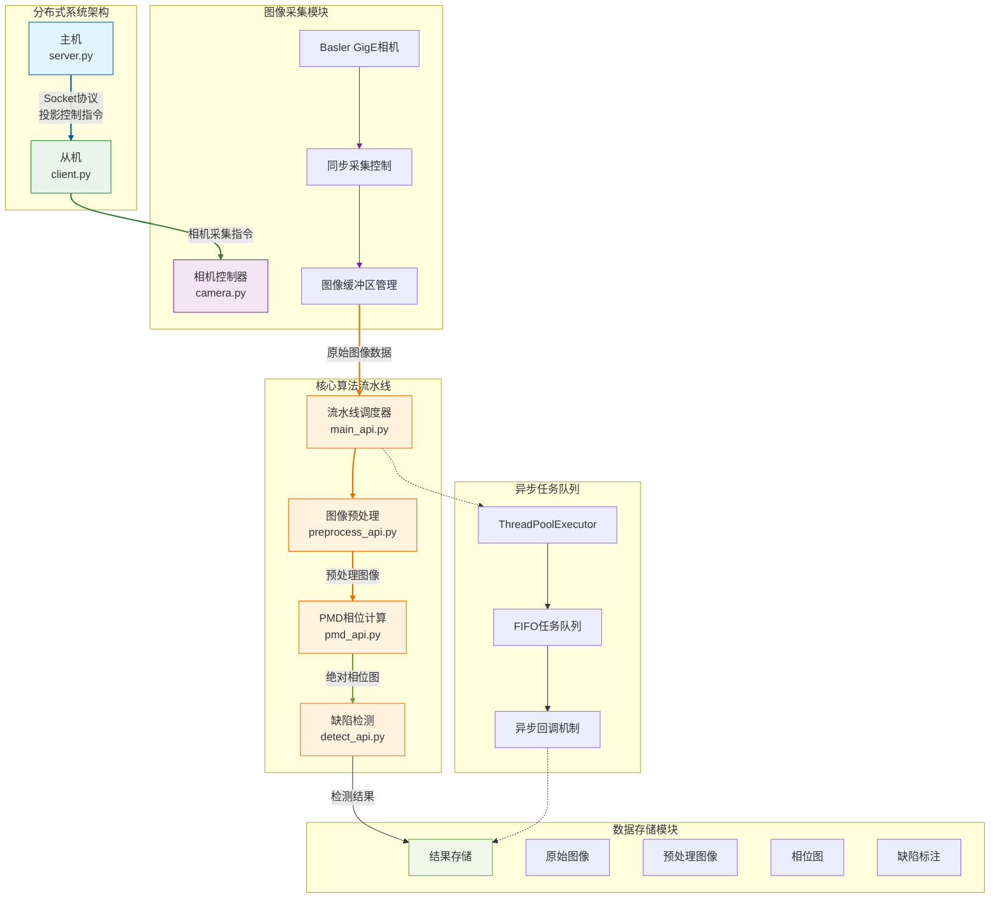

# 🛠 漆面缺陷检测系统-重写版

## 🔍 0.为什么重写：
1. 系统所有执行逻辑堆叠，维护困难  
2. IO操作与算法处理叠加，资源浪费严重  
3. 启动程序繁琐，复现困难  
4. 缺少异常处理，调试困难  

#### ⚡ **核心工作流程**



## 📂 1.当前代码结构：
`feat/framework`分支下包含：
- `framework/`：重写后代码
- `source/`：原版代码
- `test/`：测试文件

**framework文件夹结构**：
```
core/              实际运行时的核心代码
├── offline/
│  ├── calibration.py      # 计算单应性矩阵脚本
│  ├── Genetic_main.py     # 遗传算法计算格雷码二值化参数脚本
│  └── 其他离线处理脚本（待补充）
|
├── client.py    # 从机启动脚本（原slave.py）
├── server.py    # 主机启动脚本（原host.py）
└── jiege.py     # 机械臂启动

data/                  代码运行用到的数据
├── patterns/          # 投影图像
├── param.json         # 相机Homography矩阵、格雷码二值化参数
└── main_point.txt     # 存储机械臂点位

engine/                核心检测算法的代码
├── __init__.py
├── main_api.py/        # 所有算法的处理接口
│
├── preprocess/         
│  ├── __init__.py/          
│  ├── preprocess_api.py   # 成像算法处理接口
│  └── 其他文件
│
├── pmd/               
│  ├── __init__.py/          
│  ├── pmd_api.py                # pmd算法处理接口
│  ├── wrapped_phase.py         
│  ├── gc_binarization.py       
│  ├── unwrapped_phase.py       
│  └── wrapped_phase.py   
|
├── detect/             
│  ├── __init__.py/          
│  ├── detect_api.py    # 检测算法处理接口
│  └── 其他文件   

module/                系统运行需要的模块化代码
├── Camera.py          # 相机处理
├── Host.py            # 主机逻辑
└── Socket.py          # socket通信

output/                # 输出三类图像：
├── pos1               # 1. 原始图 2.拼接后的图 2. 相位图 3. 检测结果   
├── pos2            
└── posn 
                       

scripts/               # 启动脚本（待优化）
test/                  # 开发过程中用于测试的文件。
tools/                 # 开发过程中可能用到的工具类文件。
                       # 如保存机械臂位置的save_robot_pose.py等。
```

## 🧠 2.代码结构基本设计思路
1. **engine/**  
   - 核心算法（preprocess/pmd/detect），每个子文件夹都是一个算法，
   - 每个文件夹中包含一个xxx_api.py（下称子级api.py）调用当前目录中的算法，后续算法有改动的时候，只要对该文件调整即可
   - main_api.py调用各个子级api.py，是整个算法处理的接口。
   - client.py拍摄完图像后单独开一个线程，调用main_api.py进行处理
   - 后续添加：  
     - 豪杰成像算法  
     - 赵航机械臂规划算法  

2. **core/**  
   - 负责执行逻辑的代码放在core中，即core中的文件只负责调用，尽量保持简洁。
   - 若涉及到新的硬件/模块，将其放在module中
   - 示例：`client.py`调用`pmd_run.py`  

3. **core与engine的协作**  
   - 算法类执行通过子线程执行。即core中的文件，调用其他模块中的文件执行函数
   - 减少通过文件传输中间变量的过程以及读写类操作

**执行流水线**：  
`相机采集图像——>preprocess_api.py，进行拼接和有效区域提取——>pmd_api.py，生成相位图——>detect_api.py，得到检测结果。`

## ⚙️ 3.运行
所有需要运行的文件均放置在core中，包括如下三个文件。
```bash
# 从机端
python core/client.py   # 原slave.py

# 主机端
python core/server.py   # 原host.py

# 机械臂
python core/jiege.py    # 完全未改动
```

## 🔜 4.TODO
- client.py与preprocess.py（豪杰）的集成
- 机械臂和上位机通信部分代码，以及在机械臂执行过程中调用相机的测试
- 双相机时序问题

## 🚧 框架重构任务
- [x] `engine/pmd/pmd_api.py`                - 支持从config.json中加载二值化参数 @赵射
- [x] `engine/preprocess/preprocess_api.py`  - 支持从config.json中加载单应性矩阵 @赵射
- [x] `engine/main_api.py/PipelineExecutor`  - 在这里初始化的时候就将所有配置参数加载进去 @赵射
- [x] `engine/detect/detect_api.py`          - 封装检测算法调用接口
   - [x] 为了保证PMD的处理结果直接连到YOLO的输入上，需要自己实现一个GPU版本的LetterBox，对输入图像的尺寸进行resize
   - [x] 支持List[torch.Tensor]的输入
   - [x] 对torch.Tensor、List[torch.Tensor]、np.ndarray三种数据类型的输入进行接口的统一
- [ ] `engine/preprocess/stitched2.py`       - 函数输入修改、有效区域提取代码加入 @郑豪杰

- [ ] `engine/detect/detect_api.py`             - 支持参数配置、模型选择         @赵射
   - [ ] `engine/detect/detect_api.py`          - 支持从外部yaml文件读取配置     @赵射
   - [ ] `engine/detect/detect_api.py`          - 支持多模型的选择、新检测模型算法代码及权重  @赵射 @刘佳璇
- [ ] `engine/detect/detect_api.py`          - 模型部署     
   - [ ] `engine/detect/detect_api.py`          - YOLO模型部署，重点是跟PMD衔接上，以及输入模型的尺寸 @郑豪杰
- [ ] `core/robot.py`                     - 机械臂和上位机（主机）通信              @赵航 @李志翀
- [ ] `core/offline`                      - 机械臂轨迹规划算法及二值化遗传算法加入   @郑豪杰 @赵航
- [ ] `module/camera.py`                     - 双相机异步触发 @赵射
 
## ❗关于包导入
- 不同包之间的相互引用在系统复杂以后很麻烦，同学可以了解下**相对导入**和**绝对导入**这两个概念
   - 绝对导入： from framework.engine.pmd import xxx
   - 相对导入： from . import xxx
- 一般而言：
包内部调用采用相对导入（但是确保当前文件不会单独执行）
外部调用采用绝对导入（任何需要单独执行的文件都需采用绝对导入）
