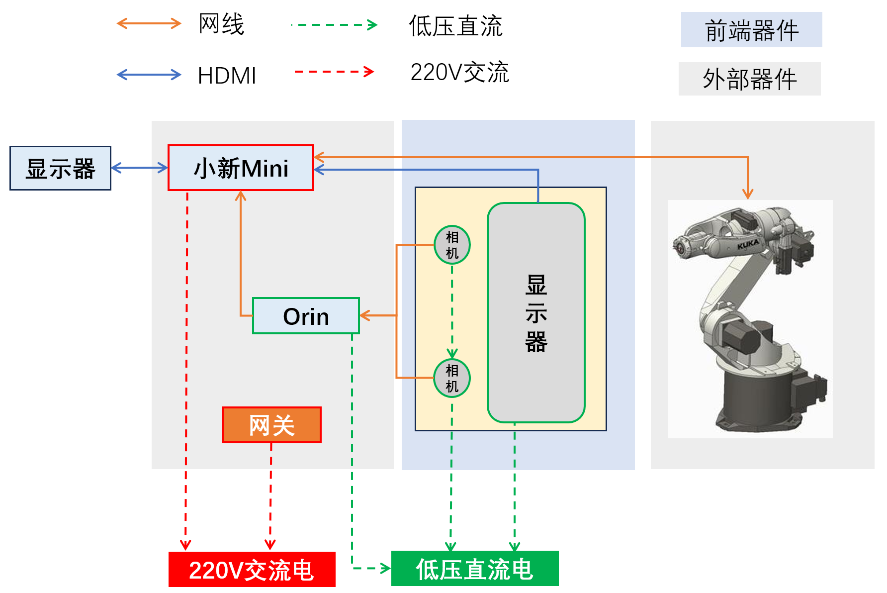
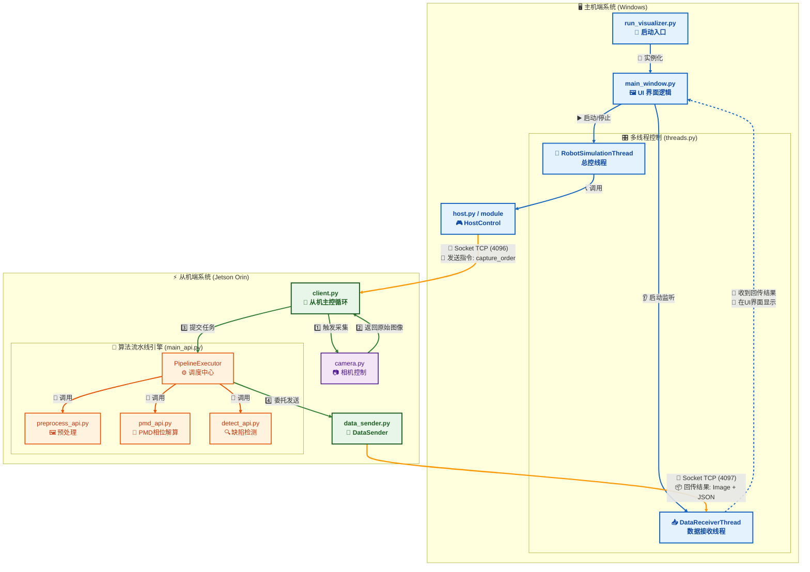

# 🛠️ 漆面缺陷智能检测系统 (Paint Defect Detection System)

<div align="center">


</div>

## 📖 项目简介

本项目是一套基于 **相位偏折测量法与图像融合模型** 的漆面缺陷检测系统。采用 **主机 (Windows) + 从机 (Jetson Orin)** 的分布式架构，通过机械臂协同、结构光投影与双相机视觉采集，实现对高反光漆面微小缺陷（如划痕、缩孔、流挂）的自动化检测与定位。

## 🏗️ 系统架构

### 🔌 硬件连接架构

**🖥️ 硬件配置清单：**

| 组件 | 型号/规格 | 数量 | 用途 |
|------|-----------|------|------|
| **主机** | 联想小新Mini (Windows 11) | 1台 | 系统控制与数据可视化 |
| **从机** | NVIDIA Jetson Orin | 1台 | 实时图像处理与算法执行 |
| **工业相机** | Basler a2A2448-105g5mBAS | 2台 | 高精度双视角图像采集 |
| **网络设备** | 万兆交换机 | 1台 | 高速数据传输 |
| **连接线缆** | 万兆网线 (CAT 6A) | 多条 | 设备间通信 |

**🔗 连接要求：**
- 🚀 **高速通信**：所有网关与网线均需支持 **10 Gbps 万兆传输**
- ⚡ **低延迟**：确保实时控制与数据传输的响应性能
- 🔒 **稳定连接**：工业级网络设备保障系统可靠性

**📊 硬件拓扑示意图：**


*图：系统硬件连接拓扑图 - 展示各设备间的物理与逻辑连接关系*

### 💻 软件工作流


## 🚀 快速开始 (Quick Start)

### 1. 启动
确保硬件已连接且环境已配置（首次运行请务必阅读 [操作手册](docs/操作手册.md)）。

**从机 (Jetson Orin):**
```bash
cd CarPaintDetection
./start_client.sh
```
**主机 (Windows):**
```bash
cd CarPaintDetection
./start_sever.bat
```
### 2. 运行
在主机界面依次点击"在线实时监控"、"启动自动检测" 即可开始作业。

## 📚 文档导航
* 🛠️ **环境搭建与操作**：详见 [操作手册 (User Manual)](docs/操作手册.md)
  *(包含：)*
* 🏗️ **技术细节与原理**：详见 [系统架构设计 (Architecture)](docs/系统架构与设计思路.md)
  *(包含：双线程模型、Socket协议定义、算法流水线)*


## 📂 代码目录说明：
重构版代码位于`feat/framework`分支下

**项目结构**
```
framework/
├── cfg/                       # 配置文件目录
│   ├── patterns/              # 投影的图像（格雷码图案等）
│   ├── config.yaml            # 模型配置文件，由人手动指定（如选用模型、图像尺寸、置信度阈值等）
│   └── param.json             # 系统参数文件，由机器计算得来（单应性矩阵、二值化阈值、机械臂轨迹点位）
│
├── core/                      # 实际运行时的核心代码
│   ├── offline/               # 离线处理模块
│   │   ├── calibration.py     # 计算单应性矩阵脚本
│   │   ├── Genetic_main.py    # 遗传算法计算格雷码二值化参数脚本
│   │   └── ...                # 其他离线处理脚本（待补充）
│   │
│   ├── client.py              # 从机启动程序入口
│   ├── run_visualizer.py      # 主机启动程序入口
│   └── robot.py               # 机械臂启动程序（用于解耦测试机械臂模块，后续会将该文件集成进gui/thread.py）
│
├── engine/                    # 核心检测算法的代码
│   ├── main_api.py            # 完整算法处理流程的接口
│   │
│   ├── preprocess/            # 成像算法处理
│   │   ├── preprocess_api.py  # 成像算法处理接口
│   │   └── 其他文件
│   │
│   ├── pmd/                   # 相位测量偏折法模块
│   │   ├── pmd_api.py         # pmd算法处理接口
│   │   ├── gc_binarization.py
│   │   ├── unwrapped_phase.py
│   │   └── wrapped_phase.py  
│   │
│   └── detect/                # 检测算法模块
│       ├── detect_api.py      # 检测算法处理接口
│       └── 其他文件
│
├── gui/                       # 相关可视化界面
│   ├── main_window.py         # UI界面设置（重要）
│   ├── styles.py              # UI界面风格
│   ├── threads.py             # 两条核心线路，数据发送线路和系统执行线路（重要）
│   └── widgets.py
│
├── module/                    # 系统运行需要的模块化代码
│   ├── camera.py              # 相机处理
│   ├── data_sender.py         # 数据发送协议
│   ├── host.py                # 主机控制逻辑
│   ├── model_config.py        # 读取cfg/config.yaml和cfg/param.json的具体配置
│   ├── protocol.py            # 从机向主机发送处理结果数据的通信协议
│   └── socket.py              # 主从机交互拍照的的通信
│
├── test/                      # 开发过程中用于测试的文件
│   ├── test_detect_api.py     # 测试detect_api.py
│   ├── test_pmd_api.py        # 测试pmd_api.py
│   └── test_main_api.py       # 测试main_api.py
│
├── tools/                     # 开发过程中可能用到的工具类文件
│   ├── set_robot_pose.py               # 保存机械臂的位姿
│   ├── set_camera_WH_exposure.py       # 设置相机的分辨率和曝光时间
│   └── visualize_det_rls.py            # 可视化检测结果
│
└── README.md                 # 项目说明文档


output/                       # 输出三类图像：
├── pos1                      # 1. 原始图 2.拼接后的图 2. 相位图 3. 检测结果   
├── ....            
└── posn 

test_images/                  # 用于测试接口的图像
├── pos1
├── ....            
└── posn                      

ultralytics_custom/           # 修改后的检测模型代码及权重

start_client.sh               # 从机启动脚本（设置mtu+启动client.py）
start_server.bat              # 主机启动脚本(启动run_visualizer.py)

legacy/                       # 暂时不用到的代码

```

## 🔜 4.TODO

### 🚧 代码框架
- [x] `script/start_server.bat`                 - 主机的启动脚本
- [x] `script/start_client.sh`                - 从机的启动脚本（设置mtu+启动client.py）
- 为整个项目添加注释


- [x] `core/visiualizer.py`                  - 将GUI界面作为主机的启动端
   - [x] `module/camera.py`                  - 当前在GUI运行两次检测图像时会报错，因为创建了两次camera对象
   - [x] `GUI/`                              - 界面需要再完善下，进入后支持两个离线和在线两种模式
   - [x] `GUI/main_window.py`                - 界面左侧的pos文件夹现在刷新不及时
   - [x] `GUI/main_window.py`                 - 将投屏和显示放在两块屏幕上

- [x] `core/visiualizer.py`                  - 添加主机结果可视化 @赵射
- [x] `engine/main_api.py`                   - 从机检测结果发送   @赵射
   - [x] `engine/main_api.py`                - 当前发送图像会发送多个preprocessed.png，估计是逻辑有问题，需要解决下
   - [x] `engine/main_api.py`                - 现在的main_api.py功能太多了，需要重构下，看起来清爽一些
- [x] `engine/pmd/pmd_api.py`                - 支持从config.json中加载二值化参数 @赵射
- [x] `engine/preprocess/preprocess_api.py`  - 支持从config.json中加载单应性矩阵 @赵射
- [x] `engine/main_api.py/PipelineExecutor`  - 在这里初始化的时候就将所有配置参数加载进去 @赵射
- [x] `engine/detect/detect_api.py`          - 封装检测算法调用接口
当前支持三个模型：


   - [x] 为了保证PMD的处理结果直接连到YOLO的输入上，需要自己实现一个GPU版本的LetterBox，对输入图像的尺寸进行resize
   - [x] 支持List[torch.Tensor]的输入
   - [x] 对torch.Tensor、List[torch.Tensor]、np.ndarray三种数据类型的输入进行接口的统一

- [x] `engine/detect/detect_api.py`             - 支持参数配置、模型选择         @赵射
   - [x] `engine/detect/detect_api.py`          - 支持从外部yaml文件读取配置     @赵射
   - [x] `engine/detect/detect_api.py`          - 支持多模型的选择              @赵射
   - [x] `engine/detect/detect_api.py`          - 新检测模型算法代码及权重, 自建一个类       @刘佳璇
   - [x] `engine/detect/detect_api.py`          - 还需要改一下__call__方法，因为不同模型的输入图像不一样，需要跟@刘佳璇对一下新模型的输入形式，最好直接将输入包装成[N, C, H, W]的Tensor
   
- [ ] `engine/preprocess/stitched2.py`       - 函数输入修改、有效区域提取代码加入 @郑豪杰
- [ ] `core/robot.py`                     - 机械臂和上位机（主机）通信，实现上位机给定一个点，机械臂走到相应的位置即可 @赵航 @李志翀 
- [ ] `gui/threads.py`                       - 将`core/robot.py`的代码集成到RobotSimulationThread里面
- [ ] `engine/detect/detect_api.py`             - 模型部署     
   - [ ] `engine/detect/detect_api.py`          - YOLO模型部署，重点是跟PMD衔接上，以及输入模型的尺寸 @郑豪杰
- [ ] `core/offline`                      - 机械臂轨迹规划算法及二值化遗传算法加入   @郑豪杰 @赵航

### 硬件系统
- [ ] `module/camera.py`                     - 双相机异步触发
 
