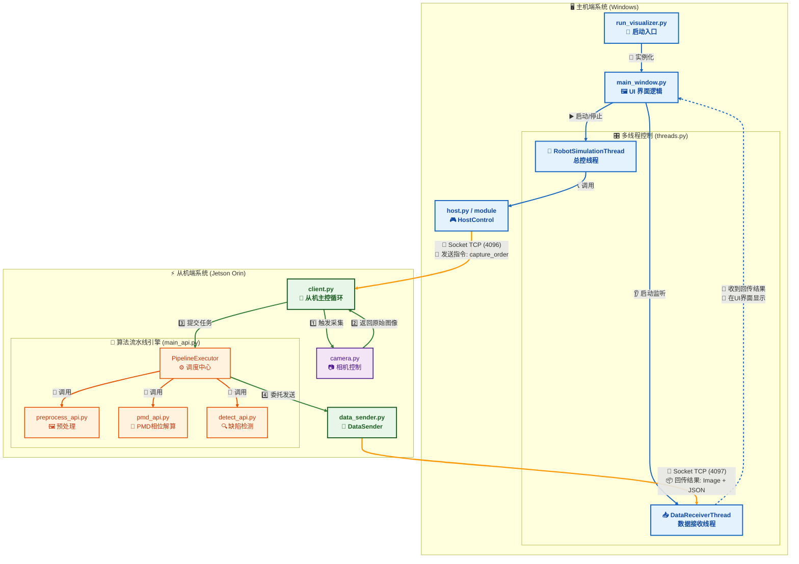

# 🏗️ 系统架构与设计思路 (System Architecture)

本文档旨在帮助开发者深入理解 **漆面缺陷智能检测系统** 的内部运作机制、代码逻辑及通信原理。如果你计划对系统进行二次开发或功能扩展，请务必阅读本章节。

---

## 目录
1. [系统架构概览](#1-系统架构概览-system-overview)
2. [核心目录与文件映射](#2-核心目录与文件映射-directory-mapping)
3. [通信协议与双通道机制](#3-通信协议与双通道机制-communication--protocol)
4. [主机端设计详解 (Host)](#4-主机端设计详解-host-architecture)
5. [从机端设计详解 (Client)](#5-从机端设计详解-client-architecture)
6. [扩展指南](#6-扩展指南-extension-guide)

---

## 1. 系统架构概览 (System Overview)

本系统采用 **分布式 C/S 架构**，物理上分离为 **主机 (Host/Windows)** 和 **从机 (Client/Jetson Orin)**。两者各司其职，通过 TCP/IP 网络协同工作。

* **主机 (UI & Control)**：负责投射图像、与从机交互、UI交互、连接机械臂。
* **从机 (Compute & Capture)**：负责多相机同步采集、与主机交互、缺陷检测推理。

### 核心交互流程图


---

## 2. 核心目录与文件映射 (Directory Mapping)

为了方便定位代码，以下是核心文件与系统功能的对应关系：

| 模块 | 核心文件 | 功能描述 |
| :--- | :--- | :--- |
| **启动入口** | `framework/core/run_visualizer.py` | **主机入口**。负责高分屏适配、多屏窗口定位、启动 GUI。 |
| | `framework/core/client.py` | **从机入口**。负责 Socket 连接、相机同步、任务分发。 |
| **GUI 界面** | `framework/gui/main_window.py` | 定义了 `OnlineTab` (监控) 和 `OfflineTab` (回放)，管理 UI 信号槽。 |
| **线程调度** | `framework/gui/threads.py` | 包含 `RobotSimulationThread` (机器人总控) 和 `DataReceiverThread` (主机接收数据)。 |
| **算法引擎** | `framework/engine/main_api.py` | **PipelineExecutor**。使用线程池管理预处理、PMD、检测算法的流水线。 |

---

## 3. 通信协议与双通道机制 (Communication & Protocol)

为了避免控制指令被大数据量的图像传输阻塞，系统设计了 **双通道 (Dual-Channel)** 通信机制。

### 3.1 控制链路 (Control Channel) - TCP 4096
* **方向**：主机 -> 从机
* **用途**：发送简短的控制指令（如开始采集、切换图案）。
* **特点**：同步阻塞模式，确保指令必达。
* **关键指令**：
    * `capture_order`：触发一次多相机采集。
    * `switch_pattern`：(从机发给主机) 通知当前图案采集完毕，请求切换下一张。

### 3.2 数据链路 (Data Channel) - TCP 4097
* **方向**：从机 -> 主机
* **用途**：回传处理后的图像和缺陷数据。
* **特点**：异步流式传输，定义了二进制包头。
* **协议结构 (DataProtocol)**：
    ```text
    [Header (12 Bytes)] + [JSON MetaData] + [Image Bytes]
    -----------------------------------------------------
    | JSON_LEN (4B) | IMG_LEN (4B) | RESERVED (4B) | ...
    ```
    * **JSON MetaData**: 包含 `pos_id` (点位ID), `filename`, `defects` (缺陷坐标), `is_last` (是否为该组最后一张)。

---

## 4. 主机端设计详解 (Host Architecture)

主机端基于 **PyQt5** 开发，采用 **UI 主线程 + 工作线程** 的分离设计，防止界面卡死。

### 4.1 启动逻辑 (`run_visualizer.py`)
程序启动时会自动检测屏幕数量：
* **GUI 界面**：强制锁定在主屏幕 (Index 0)。
* **投影窗口**：若检测到扩展屏，自动将 OpenCV 黑色背景窗口移动至副屏全屏，用于投射条纹光。

### 4.2 核心线程 (`threads.py`)
主机依靠两个后台线程维持运转：

1.  **RobotSimulationThread (总控线程)**
    * **职责**：系统的“大脑”。
    * **流程**：
        1.  连接机械臂 (PLC) 和从机。
        2.  `while` 循环遍历点位列表。
        3.  指挥机械臂移动 -> 到位后调用 `HostControl.Take_photo()`。
        4.  `Take_photo` 内部通过 Socket 发送 `capture_order` 并等待 `switch_pattern` 回执，实现投影与采集的同步。

2.  **DataReceiverThread (接收线程)**
    * **职责**：系统的“耳朵”。
    * **流程**：
        1.  监听端口 `4097`。
        2.  循环接收数据包，解析协议头。
        3.  将图片和 JSON 保存至 `output/` 文件夹。
        4.  通过 Qt 信号 `data_received` 通知 UI 刷新画面。

---

## 5. 从机端设计详解 (Client Architecture)

从机端的设计核心是 **“异步处理”** 和 **“多相机同步”**。

### 5.1 同步采集机制 (`client.py`)
为了确保两个（或多个）相机都拍完了同一张图案，引入了 `CaptureTracker` 类。
* **逻辑**：
    * 每当一个相机触发回调，`tracker.received_serials.add(serial)`。
    * 检查 `received_serials == expected_serials`？
    * **是** -> 说明所有相机都拍完了 -> 向主机发送 `switch_pattern` -> 清空状态等待下一轮。

### 5.2 异步算法流水线 (`main_api.py`)
为了不让繁重的算法计算（PMD、YOLO）阻塞相机的连续采集，采用了 `ThreadPoolExecutor`。
* **PipelineExecutor 设计**：
    * **主线程**：只负责收图，收到图后立即扔进线程池 `executor.submit(...)`，然后立刻回头响应下一次采集。
    * **工作线程**：在后台慢慢跑 `_execute_pipeline` (预处理 -> 相位解算 -> 缺陷检测)。
    * **回调 (Callback)**：算法跑完后，自动触发 `_result_callback`，调用 `DataSender` 将结果发回主机。

---

## 6. 扩展指南 (Extension Guide)

### 6.1 如何集成真实的机械臂？
1.  编写机械臂控制类（需包含阻塞式的 `move_to_pose` 方法）。
2.  修改 `framework/core/threads.py` 中的 `RobotSimulationThread`。
3.  在 `run()` 方法的循环中，将 `time.sleep(2)` 替换为机械臂移动代码。

### 6.2 如何更换检测模型？
1.  将新的 `.pt` 模型文件放入 `framework/engine/detect/weights/`。
2.  修改 `framework/cfg/config.yaml` 中的 `detect` 字段，更新模型路径和置信度阈值。

### 6.3 如何修改投影图案？
1.  将新的条纹图片放入 `framework/cfg/patterns/` 下的新文件夹（如 `my_pattern`）。
2.  修改主机代码或配置文件，将加载路径指向新文件夹。

---
> 📅 **文档更新日期**: 2025-12-30
> 📧 **技术支持**: (赵射/QQ1957972156)